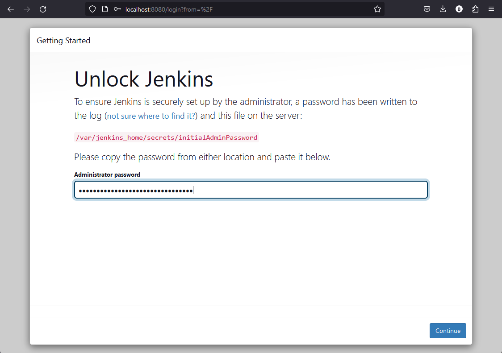
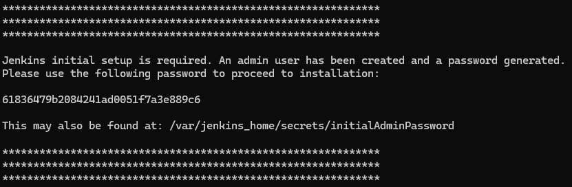
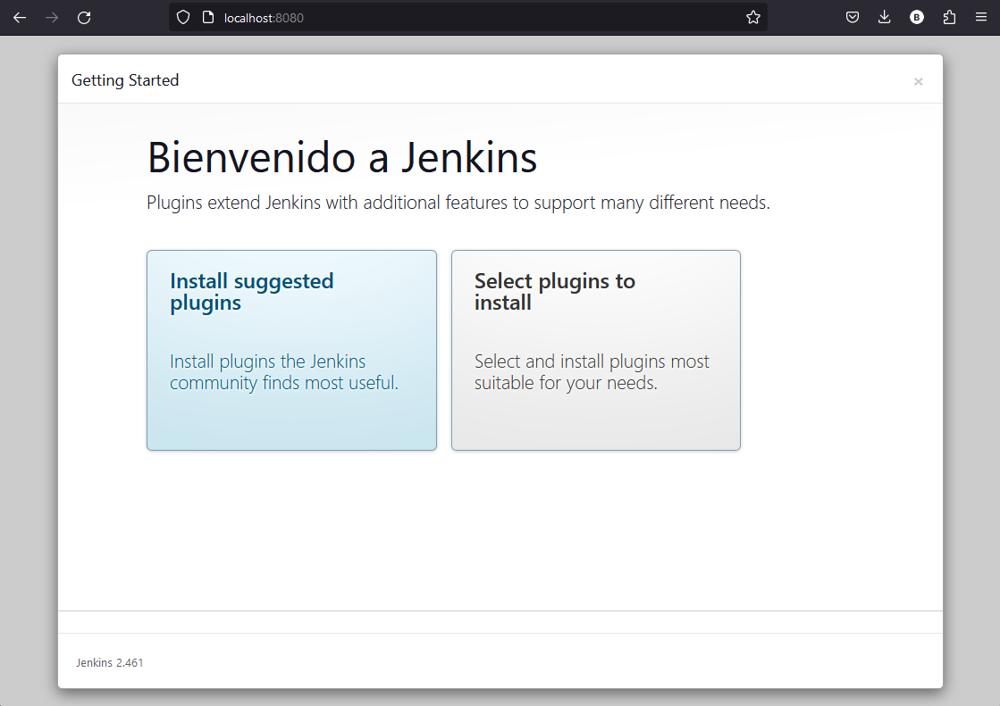
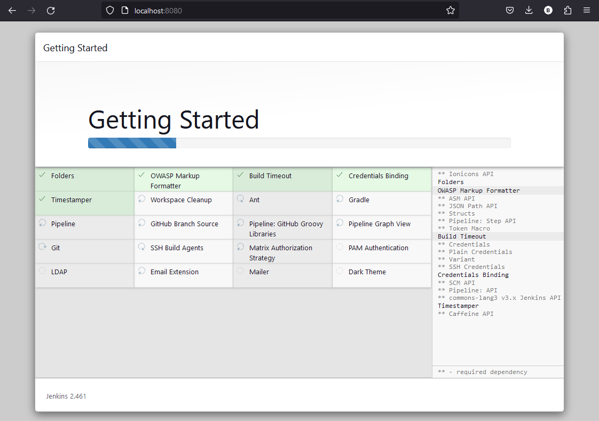
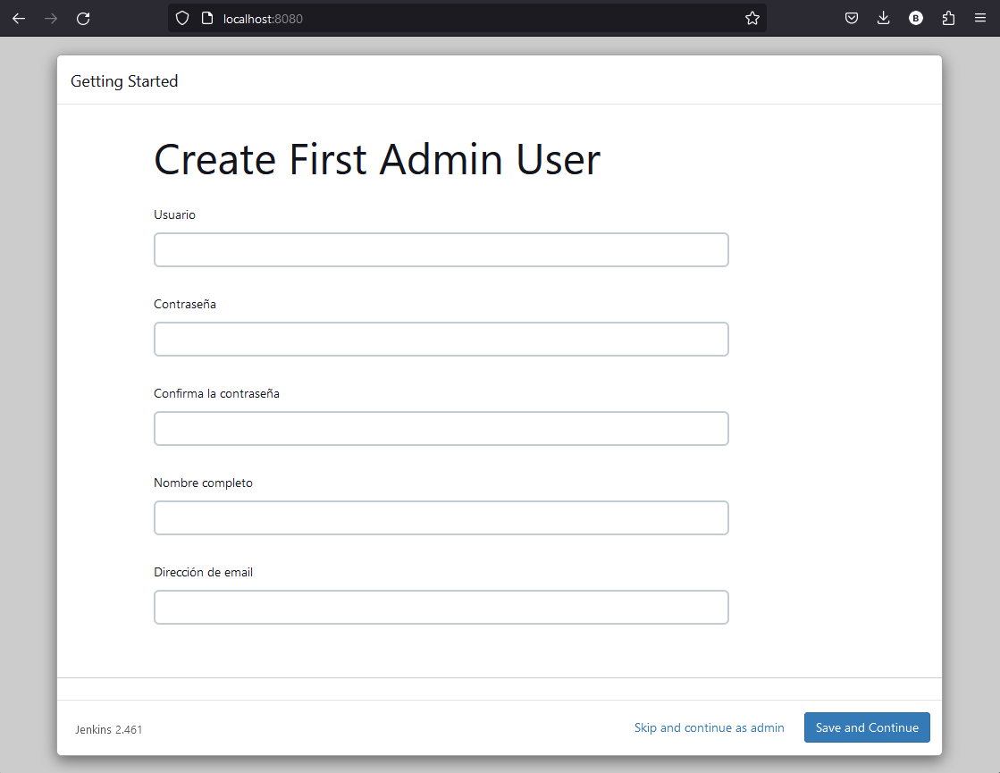
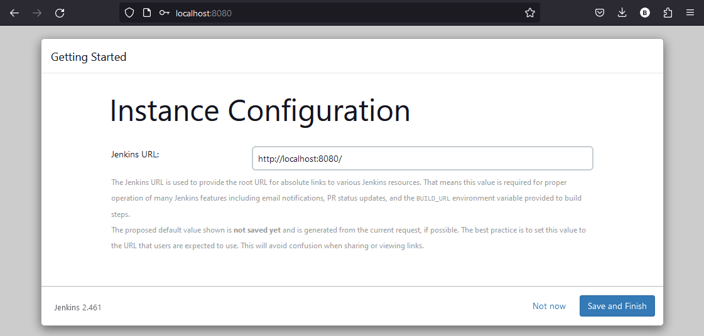

# Integración Continua con Jenkins y GitHub

## Herramientas y recursos necesarios

- Instalar Docker

## Pasos a seguir para la instalación

1. Ejecutar Docker Compose utilizando el archivo [Jenkins Docker Compose](./jenkins.docker-compose.yaml) para construir la imagen de Jenkins compatible con NodeJS y posteriormente ejecutarla.
```bash 
$ docker compose -f jenkins.docker-compose.yaml up -d
```

2. Ingresar al endpoint principal de Jenkins [(http://localhost:8080/)](http://localhost:8080/). Al ingresar se nos solicitará una contraseña para su configuración. Esta la podemos encontrar en los logs del contenedor al crear por primera vez.


3. Accedemos a los logs con el siguiente comando.
````bash
$ docker logs jenkins_app
````

4. Se nos mostrará esta imagen. Copiamos la clave entregada y la ingresamos al panel. Luego pulsamos en Continue.


3. En la sigiente pantalla, se nos solicitará instalar los plugins. Seleccionar la opción "Install suggested plugins" para inicial la instalación de los más importantes.

Esperamos a que se terminen de instalar todos los plugins.


6. Posteriormente, se nos solicitará crear un usuario con acceso de administrador. Rellenamos los datos (no tienen que ser necesariamente reales para el ejemplo) y pulsamos en "Save and Continue".


7. En este paso, se ingresa la URL que usará Jenkins para utilizar sus recursos (cuando otro servicio quiera conectarse con Jenkins). En este caso se utilizará la configuración local.
Terminamos la configuración pulsando en "Save and Finish"


8. Listo. Con esto se instala Jenkins en nuestro computador de forma local y listo para utilizar.
