# Instrucciones para utilizar Jenkins con NodeJS e integración con GitHub

## Preparación
Es necesario crear una cuenta en [Ngrok](https://ngrok.com/) para ejercutar el Bypass http por el puerto 8080.
Luego de eso, se debe recuperar el Token de Autentificación y el dominio estático y agregarlo a las variables de entorno en un .env, estableciendo las variables NGROK_AUTHTOKEN y NGROK_STATIC_URL respectivamente.

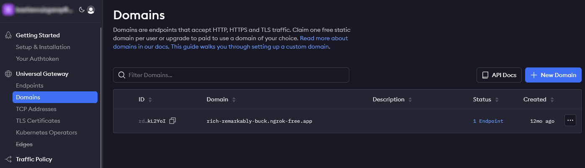
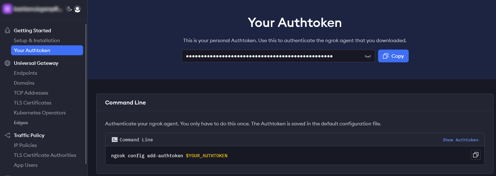

Para la configuración del Pipeline con GitHub, es necesario crear un Personal Access Token. Esta opción se encuentra en Configuración -> Configuración de Desarrollador.

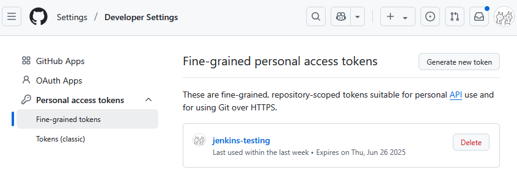

## Ejecución
Tanto el Dockerfile como el docker-compose.yaml estan configurados para iniciar, por lo que solo se debe ejecutar el Docker Compose:

```sh
$ docker compose up -d
```

## Configuración inicial de Jenkins
Cuando Jenkins se ejecute, se creará una clave de autentificación de usuario administrador, la que se puede recuperar de los logs.

```sh
$ docker logs jenkins-node-only
```

Luego se accede al servicio de forma local [http://localhost:8080](http://localhost:8080) y se realizan los pasos iniciales:
- Ingreso de contraseña de administrador.
- Instalación de los plugins sugeridos.
- Creación de cuenta de usuario no administrador.
- URL de acceso a Jenkins (Se deja tal como está).

Todos estos pasos se encuentran en el [documento de configuración inicial de Jenkins](../01-Jenkins-ci-instructions-es.md)

## Configuración de plugin de GitHub
Para que Jenkins pueda ver los cambios a los repositorios asociados a los pipelines, debemos configurar un servidor de escucha de GitHub (GitHub Server). Para esto debemos dirigirnos a las opciones de sistema en Administrar Jenkins.

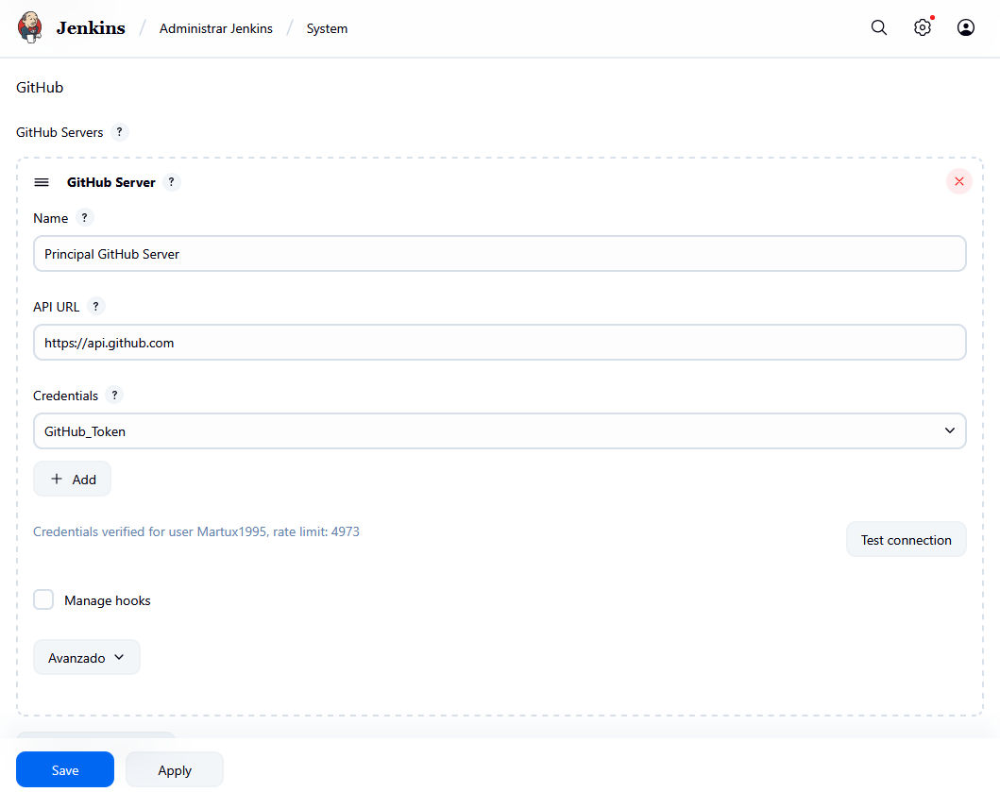

En este paso, debemos seleccionar la opción por defecto (GitHub Sever) y configurar las opciones:
- Name: Nombre representativo.
- API URL: Ubicación de los repositorios de GitHub. Esto se cambia en caso de utilizar una solución Enterprise de GitHub.
- Credentials: Se agrega una clave tipo "Secret Text" con el Token creado en GitHub y se asocia con un ID y Descripción representativo. Luego de crear la credencial, se selecciona del listado.

Luego, podemos presionar en el botón "Test connection" para probar que la configuración se haya realizado correctamente. Finalmente, guardamos los cambios.

## Configurando el Pipeline de Integración Continua (CI)
Para configurar nuestro primer pipeline, será necesario tener la URL del repositorio.

Antes de comenzar, debido a que estamos utilizando Ngrok, será necesario activar la compatibilidad con Proxies. Esto se realiza en el apartado de seguridad de Jenkins, en la sección "CSRF Protection".

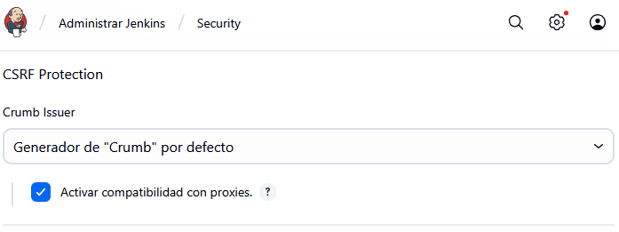

Para comenzar, debemos crear un nuevo pipeline con la opción "Create a Job", configurando un nombre y seleccionando la opción "Proyecto de estilo libre". 

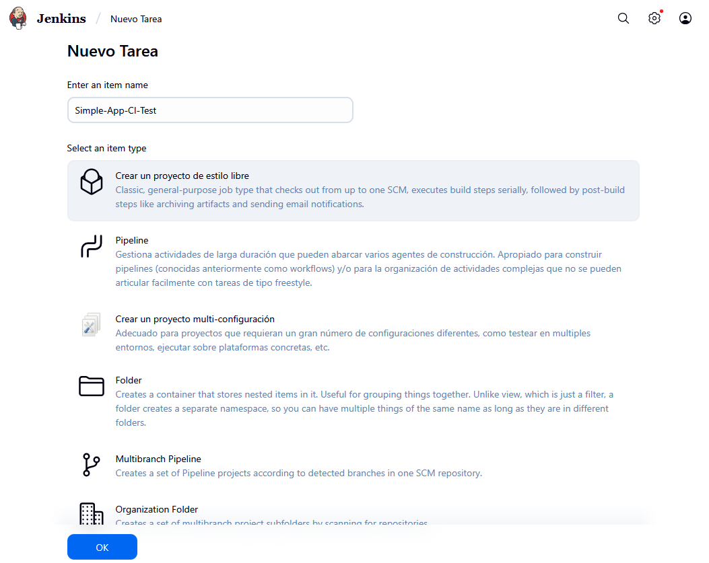

Esto nos creará un nuevo Pipeline donde podremos configurar múltiples opciones. En este caso, tomaremos lo mas importante.

### Configurar origen del código fuente

Para la configuracion del repositorio, debemos seleccionar la opción de Git. En el cuadro desplegado, agregamos la URL de nuestro repositorio de GitHub en "Repository URL". En el caso que sea un repositorio privado, será necesario configurar una credencial para que Jenkins tenga acceso a este.

Luego, en las opciones de Ramas (Branches), debemos configurar las ramas que Jenkins observará para ejecutar el Pipeline.
Si se utiliza un enfoque de ramificación estilo GitFlow, se pueden crear 4 pipelines que verifiquen las ramas del estandar:
- Rama Main: */main
- Rama Dev: */dev
- Ramas feat: */feat/\*
- Ramas fix: */fix/\*

En el caso de un enfoque estilo Trunk-Based Development, se puede utilizar la configuración de main y feat

En el caso de este pipeline, el cual se encarga de revisar los cambios a integrar en el repositorio, podemos agregar todas las ramas al mismo pipeline, que podemos hacerlo con la expresion \*/\* para ramas principales, o \*/** para considerar las subramas.

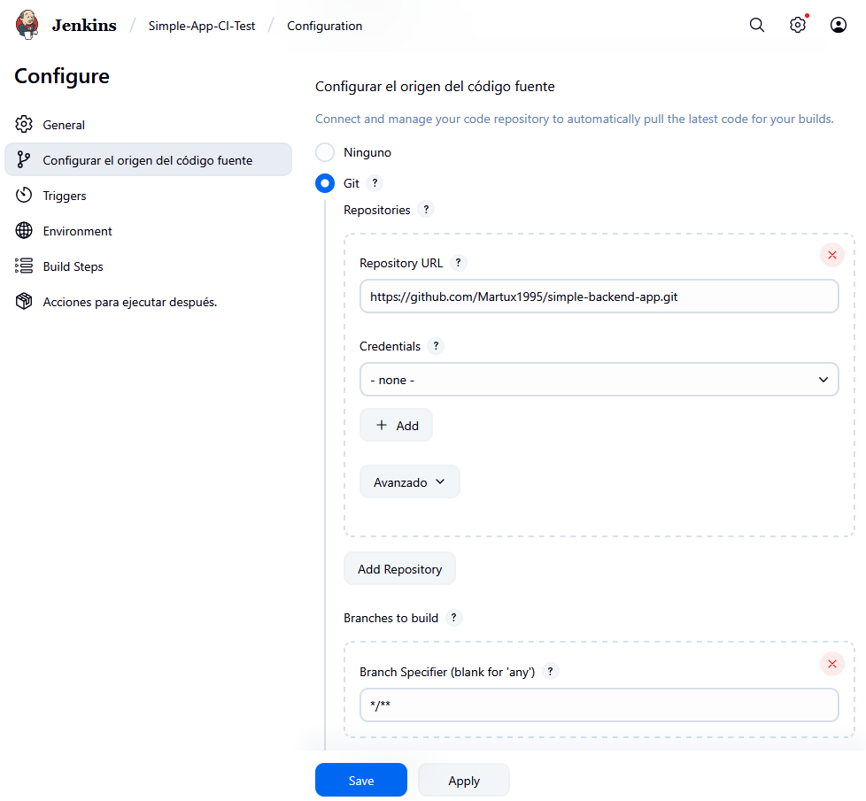

Luego, en las opciones de Triggers, se debe seleccionar la opción "GitHub hook trigger for GITScm polling" para que Jenkins actúe cuando el repositorio de GitHub ejecute un Webhook al momento que reciba un Push.

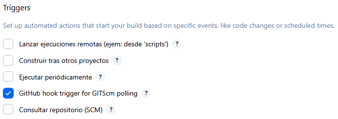

### Configurar pasos de buildeo

Finalmente, agregamos los pasos para que la aplicación se construya y se ejecute la suite de pruebas.
El repositorio [simple-backend-app](https://github.com/Martux1995/simple-backend-app) esta construido bajo [NestJS](https://nestjs.com). Por lo tanto, los comandos que se deben ejecutar son:

```sh
$ npm install   # Para instalar las dependencias del repositorio.
$ npm run build # Para construir la aplicación y revisar errores de sintaxis.
$ npm run test  # Para ejecutar las pruebas definidas con Jest.
```

Para este paso, creamos un paso de "Ejecutar linea de comandos (shell)" y definimos los tres comandos en el mismo orden.

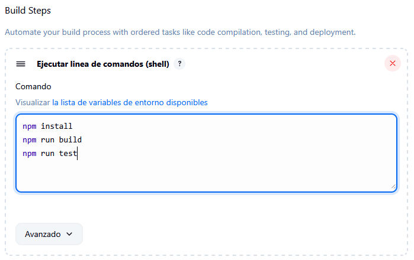

## Configuración del WebHook de GitHub

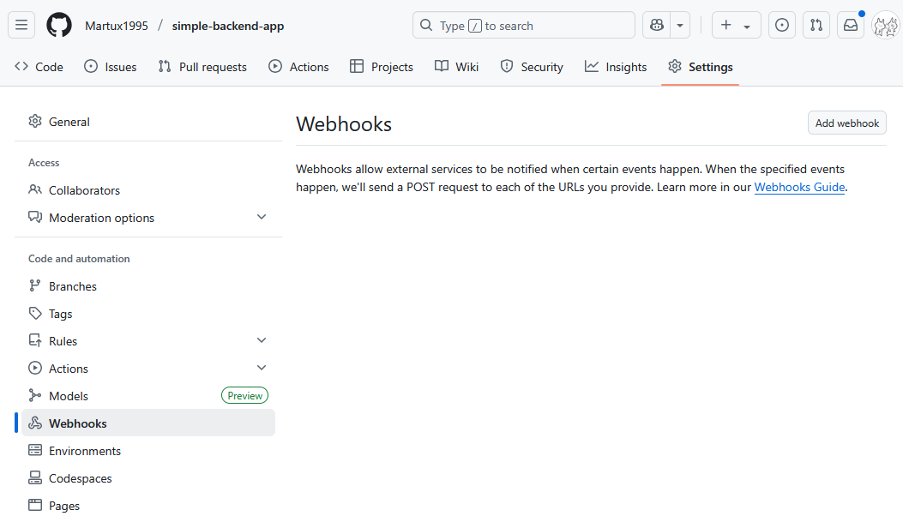

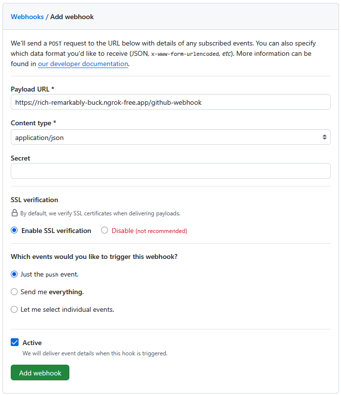